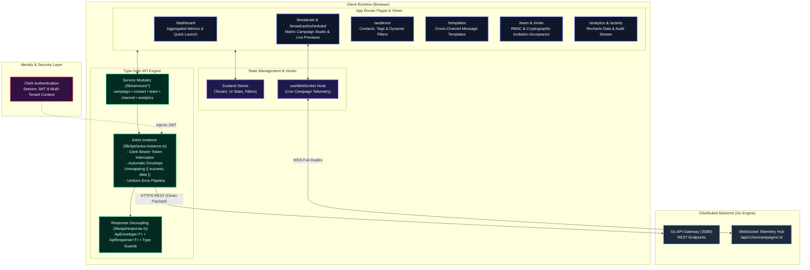

# OmniPulse Control Plane: Mission-Critical Omnichannel Broadcast Dashboard

<p align="center">
  
  
  
  
  
  
  
  
</p>

<p align="center">
  <a href="https://omnipulseng.vercel.app"><strong>View Live Production App ➔</strong></a>
</p>

---

## Executive Summary

The **OmniPulse Control Plane** is a high-performance web dashboard built with **Next.js 16 (App Router)** and **React 19**. It serves as the unified command center for composing, scheduling, and orchestrating mass cross-platform broadcasts (**WhatsApp Cloud API, Telegram Bot API, and X API**) while streaming live distributed telemetry back to operators in real-time.

Engineered to handle the complexity of distributed messaging backend systems, the control plane features a triple-platform preview simulator, live WebSocket progress monitors, strict type-safe decoupled response unwrapping, and tenant-isolated team management with cryptographic invitation acceptance.

---

## Frontend Architecture



---

## Core Features & Implementation Details

### 1. Matrix Campaign Studio (Triple-Platform Simulator)
Composing messages for multiple networks requires handling competing structural constraints simultaneously:
* **WhatsApp**: Supports formatting with asterisks (`*bold*`), utility templates, and 1,024-character limits.
* **Telegram**: MarkdownV2 styling, inline keyboards, and 4,096-character limits.
* **X (Twitter)**: Strict 280-character ceiling and restricted external link formatting.

The **Matrix Campaign Studio** features an active live preview simulator. As the user types variables like `{{first_name}}` or `{{order_id}}`, the UI dynamically computes real-time length, syntax validation, and platform-specific device mockups side-by-side, preventing submission of invalid payloads before hitting the network.

### 2. Live WebSocket Telemetry & State Tracker
Rather than polling API endpoints for long-running broadcasts (e.g. 50,000 messages), the UI opens a bi-directional WebSocket connection (`/api/v1/ws/campaigns/:id`):
* Renders real-time delivery funnels: `Queued`, `In Flight`, `Rate-Limited (Cooling Down)`, `Delivered`, and `Failed`.
* Animated progress bars and velocity counters built with **Framer Motion** that update smoothly without UI jitter.
* Graceful fallback: Automatically falls back to exponential backoff polling if a client firewall blocks WebSocket upgrades.

### 3. Decoupled Centralized API Response Architecture
To eliminate duplicate `.data.data` unwrapping and inconsistent error structures between frontend and backend, the application utilizes a centralized contract:
```typescript
// lib/api/response.ts
export type ApiSuccess<T> = { success: true; data: T };
export type ApiErrorResponse = { success: false; error: string; code?: string };
export type ApiEnvelope<T> = ApiSuccess<T> | ApiErrorResponse;
```
The **Axios response interceptor** automatically unwraps backend envelopes. Callers receive the typed domain payload directly via `response.data`, while server error strings are extracted and formatted cleanly for toast notifications (`sonner`).

### 4. Multi-Tenant RBAC & Cryptographic Invitation Lifecycle
* **Role-Based Access Control**: Granular permission checks for `Owner`, `Admin`, and `Member` across campaign deletion, channel credential configuration, and team management.
* **Cryptographic Invitation Flow (`/invite?token=...`)**:
  1. Invitee receives a unique 64-character hex token with a 48-hour TTL.
  2. Public preview endpoint allows the user to inspect workspace details prior to authentication.
  3. If unauthenticated, Clerk routes the user through sign-up with the invite state preserved in query parameters.
  4. Post-authentication, the token is claimed atomically, binding the user to the tenant workspace.

### 5. Dark-Mode Glassmorphism Design System
* Engineered from the ground up using **TailwindCSS v4**, custom CSS variables, and **Framer Motion**.
* High contrast dark aesthetics (`#020617` base) with subtle border glows, glassmorphic cards (`backdrop-blur-md`), and curated accent palettes.
* Fully responsive across mobile, tablet, and widescreen operational dashboards.

---

## Directory Topography

```
frontend/
├── app/                        # Next.js 16 App Router
│   ├── (auth)/                 # Authentication routes (Sign-in / Sign-up)
│   ├── activity/               # Live delivery audit stream
│   ├── analytics/              # Aggregated campaign metrics (Recharts)
│   ├── audience/               # Contact directory & tag segmenter
│   ├── broadcast/              # Campaign composer & scheduling studio
│   │   └── scheduled/          # Scheduled campaigns management
│   ├── connections/            # Multi-channel API credentials manager
│   ├── dashboard/              # Primary operations room
│   ├── get-started/            # Onboarding launchpad
│   ├── invite/                 # Public invitation preview & acceptance
│   ├── onboarding/             # Multi-step brand & channel setup wizard
│   ├── team/                   # Workspace RBAC & team management
│   ├── templates/              # Cross-channel template authoring
│   ├── layout.tsx              # Root shell with Clerk & Theme Providers
│   └── page.tsx                # Marketing landing & entry point
├── components/                 # Reusable UI component library
│   ├── ui/                     # Primitives (Buttons, Dialogs, Inputs, Tooltips)
│   ├── navigation/             # App sidebar, header, and command menu
│   └── shared/                 # Data tables, badge indicators, modals
├── lib/
│   ├── api/
│   │   ├── axios-instance.ts   # Configured Axios client with interceptors
│   │   └── response.ts         # Centralized API response types & unwrappers
│   ├── constants/
│   │   └── endpoint.const.ts   # Centralized REST & WebSocket route definitions
│   └── services/               # Strongly-typed domain services
│       ├── analytics.service.ts
│       ├── campaign.service.ts
│       ├── channel.service.ts
│       ├── contact.service.ts
│       ├── dashboard.service.ts
│       ├── notification.service.ts
│       ├── tag.service.ts
│       ├── team.service.ts
│       └── template.service.ts
├── hooks/                      # Custom hooks (useWebSocket, useDebounce, etc.)
└── types/                      # Domain interfaces and global definitions
```

---

## Getting Started

### Prerequisites
* **Node.js**: `v20.x` or higher
* **npm**: `v10.x` or `pnpm` / `bun`

### 1. Installation
```bash
git clone https://github.com/develoFavour/omnipulse.git
cd omnipulse
npm install
```

### 2. Configure Environment Variables
Create a `.env.local` file in the root directory:

```env
# Go API Gateway Base URL
NEXT_PUBLIC_API_URL=http://localhost:8080

# Clerk Authentication Keys
NEXT_PUBLIC_CLERK_PUBLISHABLE_KEY=pk_test_...
CLERK_SECRET_KEY=sk_test_...

# Clerk Auth Routes
NEXT_PUBLIC_CLERK_SIGN_IN_URL=/sign-in
NEXT_PUBLIC_CLERK_SIGN_UP_URL=/sign-up
NEXT_PUBLIC_CLERK_AFTER_SIGN_IN_URL=/dashboard
NEXT_PUBLIC_CLERK_AFTER_SIGN_UP_URL=/onboarding/welcome
```

### 3. Run Development Server
```bash
npm run dev
```
Open [http://localhost:3000](http://localhost:3000) in your browser.

### 4. Build for Production
```bash
npm run build
npm run start
```

---

## Tech Stack Summary

| Layer | Technologies |
| :--- | :--- |
| **Framework** | Next.js 16 (App Router, Turbopack) |
| **Library** | React 19 |
| **Language** | TypeScript 5 |
| **Styling** | TailwindCSS v4, CSS Modules |
| **Animations** | Framer Motion 12 |
| **Auth & Identity**| Clerk (JWT, User Management, Organization/Tenant Context) |
| **State Management**| Zustand 5 |
| **Data Visualization** | Recharts 3 |
| **Forms & Validation** | React Hook Form, Zod |
| **HTTP & Networking**| Axios with Auto-Unwrap Interceptors, Native WebSockets |
| **Icons & Design** | Lucide React, React Icons |
| **Notifications** | Sonner |

---

## License

OmniPulse is open-source software licensed under the [MIT License](LICENSE).
